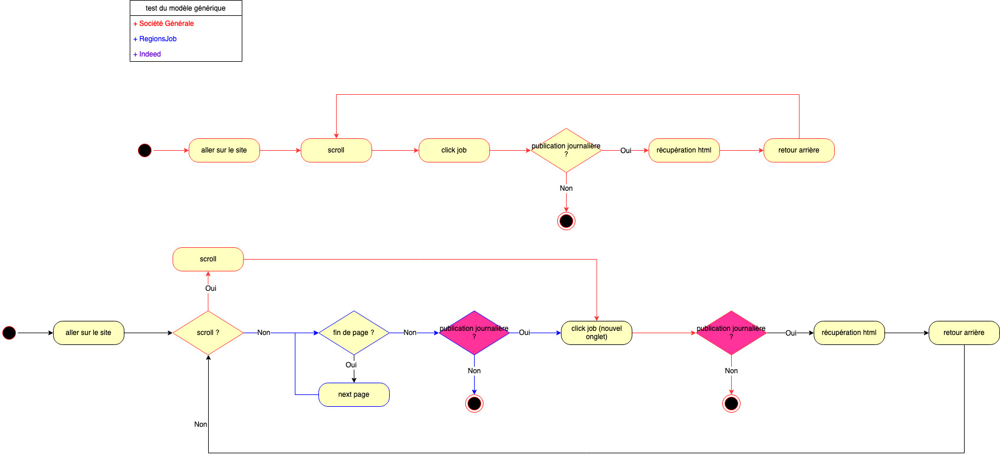
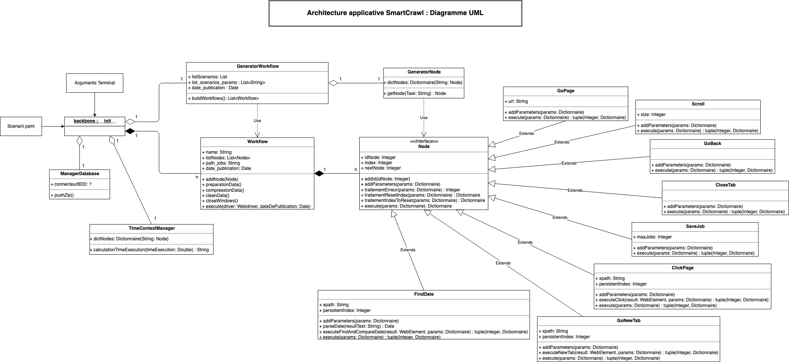

**********************
Documentation du code
**********************

Choix des technologies
=======================

La solution finale, validée par l’entreprise SmartPath le 24/10/2019, est construite autour de BeautifulSoup et Selenium. Ces outils répondent à toutes les problématiques données: python, simplicité, paramétrables, mises à jour, communauté active de développeurs.

De plus, l’utilisation de technologies connues par l’équipe de développement de SmartPath leur permettra, à l’issue de la livraison du produit, de maintenir et faire évoluer facilement ce crawler web intelligent en fonction des besoins de l’entreprise.

Nous choisissons de nommer notre projet **SmartCrawl**.

Contraintes fonctionnelles
===========================

Afin de réaliser cette architecture, nous nous sommes intéressés aux contraintes que nous devions prendre en compte pour la réalisation de SmartCrawl:
	- Nous devions réaliser un crawl sur des sites spécifiques. Il faut donc fournir l’URL du site à SmartCrawl.
	- De même, nous devons faire le scraping total de la page html de chacune des offres d’emploi désignées. L’outil doit donc se déplacer de manière précise sur la page web voulue. Pour cela, il est nécessaire d’identifier et d’extraire les liens en question pour y accéder. Chaque site étant différent, ce sont donc des paramètres spécifiques qui leur sont propres.
	- Enfin, l’accès à la donnée diffère en fonction des sites web. En effet, même si globalement les sites web d’offres d’emploi ont des interfaces similaires, les actions à réaliser et l’ordre dans lequel nous devons les effectuer sont différents.

Ces contraintes peuvent être observées sur le diagramme de processus ci-dessous, réalisé à partir de trois sites webs, ceux de la  Société Générale, de RégionsJob et Indeed. Ici, nous appelons “processus” l’ensemble des actions à réaliser dans un ordre spécifique pour arriver à la donnée voulue. SmartCrawl devant être le plus intelligent possible, et donc s’adapter à tout type de site web, il doit réaliser le scraping des données pour chacun de ces processus.

Le premier diagramme correspond au processus de celui de la Société Générale. Le second diagramme, créé à partir du premier, a évolué en vue de prendre en compte le processus des actions à réaliser de RegionsJob. En effet, l’objectif est que ce diagramme évolue en vue de s’adapter à tous les sites choisis. Nous pouvons voir que le fonctionnement est différent. En effet, pour RegionsJob nous devons cliquer sur les pages suivantes pour accéder à de nouvelles offres et non “scroller” vers le bas. De plus, l’identification de la date de publication est réalisée avant de cliquer sur la page du job.

En conséquence, nous avons deux fois la même tâche, “Identification de la date de publication”, à des moments différents du processus et pour deux sites différents, ce qui crée une certaine redondance qui peut s’accentuer si l’on continue d’ajouter les processus d’autres sites web. Une fois le diagramme mis à jour pour fonctionner sur les deux premiers sites, il s’avère qu’aucune modification n’est nécessaire pour fonctionner sur Indeed. Ceci démontre le fait que ces pages spécifiques ont globalement les mêmes actions à réaliser, mais qu’il n’est pas possible de généraliser un seul processus applicable à toutes les pages.

**Conclusion** **n°1** : Nous ne pouvons nous satisfaire de ce type d’architecture, à savoir la création d’un processus s’adaptant à toutes les pages web voulues car il deviendrait de plus en plus complexe et figé, et surtout pourrait être bloqué à l’avenir par l’entropie du web.

En outre, dans la très grande majorité des sites qui font du crawling/scraping, quand ils n'arrivent pas à accéder à une page, ils ne prennent pas la peine de chercher toutes les informations et celles-ci restent partielles, voire absentes. Nous pouvons prendre pour exemple l’un des outils de Google: Shopping. Il affiche uniquement les pages qu'il arrive à décrypter et certains sites sont déjà à cette étape ignorés. La quantité d’informations récupéré diffère d’une source à une autre; l’outil n’affiche donc pas les mêmes natures de données selon les sources. Nous en déduisons que même les outils les plus perfectionnés sur le web ont une intelligence limitée et ne récupèrent pas toutes les informations, alors que dans notre cas, le client a besoin de pages d’offres d’emplois les plus complètes possibles et de manière fiable, afin de réaliser les études et statistiques qui alimentent le coeur de son activité.

**Conclusion** **n°2** : L’intelligence de SmartPath doit porter sur l’assurance du client d’obtenir des offres d’emploi “complètes” et utiles à son activité. 

Architecture fonctionnelle
===========================

En vue de rendre le crawler le plus générique possible, afin qu’il puisse être adaptable à n’importe quel site web, nous choisissons de réaliser un programme possédant toutes les fonctionnalités de navigation entre les pages et de scraping. Ce programme peut être considéré comme une boîte noire, c’est à dire qu’il n’y a pas nécessité de le comprendre ou de le modifier pour qu’il s'exécute correctement. SmartCrawl est autonome.

Toutefois pour fonctionner, nous devons lui fournir les variables propres à chaque site web et l’ordre des actions qui doivent être réalisées. Nous appelons le regroupement de ces informations un “Scénario”. Un scénario est propre à un seul site web.

Un scénario se décompose en liste d’actions. Ces actions représentent ce que ferait un être humain pour naviguer entre les pages : cliquer sur un lien, lire une date, revenir en arrière...

Afin que ces données soient écrites de façon structurée et compréhensible pour SmartCrawl, il est nécessaire qu’elles soient au format YAML, en respectant l’ontologie prévue à cet effet. Le choix du format YAML est déterminé par le fait que la lecture et le remplissage sont relativement faciles et accessibles à tous.

L’ontologie décrit le fonctionnement de tous les modules de SmartCrawl, leurs paramètres, ainsi que le format attendu. Des exemples sont également fournies.

SmartCrawl agit comme un moteur d’exécution des scénarios. Il est composé de différents modules capables de réaliser toutes les actions utiles et permettant l’accès à la donnée souhaitée.

Néanmoins, il est nécessaire de remplir manuellement les scénarios dans le fichier de configuration après analyse du site web choisie. Une fois réalisé, le crawl du site web, avec la récupération des données souhaitées sera automatisé. SmartCrawl est fiable.

Les scénarios sont simples et concis. Toutefois, il faut prêter une attention particulière lors de leur écriture. Le choix de l’architecture de SmartCrawl permet d’avoir un outil puissant capable de s’adapter à presque tous les sites web, et offre de nombreuses possibilités via la souplesse qu’offre l’écriture des scénarios.

Architecture applicative
===========================

Entrées de SmartCrawl :
~~~~~~~~~~~~~~~~~~~~~~~~

Le programme SmartCrawl peut se lancer via le Terminal, lorsque l’on se trouve dans le répertoire ‘SmartCrawl’. Il prend en entrée un fichier de scenarios en YAML, appelé scenarii.yaml, situé dans le même répertoire, et éventuellement les paramètres suivants :

**Fichier de scénario** : 
	Si l’on souhaite crawler les scénarios écrits dans un autre fichier que celui définit par défaut, à savoir :  scenarii.yaml.
	   - Clé : ‘-f’
	   - Exemple : python __init__.py -f ./monFichier.yaml

**Date de publication** :
	Si l’on souhaite récupérer les offres d’emploi publiées depuis une date X.
	   - Clé : ‘-d’
	   - Exemple : python __init__.py -d 01/01/2020

	Notons que la date sera parsée avec datepaser. Ainsi, il est possible de lui donner différents formats :
	   - Exemple : python __init__.py -d 2020-01-01

**Liste des scénarios à crawler** :
	Si l’on souhaite réaliser un crawl seulement sur certains scénarios bien précis. Ils doivent se trouver dans le fichier YAML.
	   - Clé: ‘-s’
	   - Exemple : python __init__.py -s AIRBUS

	Notons qu’il est possible de spécifier plusieurs scénarios. Toutefois, il faut rajouter systématiquement la clé avant :
	   - Exemple : python __init__.py -s AIRBUS -s AIRFRANCE

**Maximum jobs** : 
	Lorsque l’on souhaite limiter le nombre d’offres d’emploi à télécharger pour chaque site web.
	   - Clé : ‘-m’
	   - Exemple : python __init__.py -m 50

**Navigateur** : 
	Lorsque l’on souhaite effectuer le crawl sur un navigateur en particulier. SmartCrawl prend nativement en compte chrome et firefox.
	   - Clé : ‘-n’
	   - Exemple : python __init__.py -n chrome

	Par défaut, SmartCrawl effectuera un crawl de tous les scénarios situés dans scenarii.yaml, à la date d’hier, sans aucune limitation de téléchargement, et sur la navigateur Firefox.

Enfin, notons que nous pouvons utiliser toutes ces commandes en même temps et dans n’importe quel ordre : 
   - Exemple : python __init__.py -s AIRBUS -d 20/03/2020 -n chrome AIRFRANCE -m 50

Hors cas des scénarios choisies pour le crawl, si vous précisez plusieurs fois la même clé, seule la dernière sera retenue.
   - Exemple :  python __init__.py -s AIRBUS -m 5 -m 1

SmartCrawl téléchargera maximum 1 seul job.

Sorties de SmartCrawl :
~~~~~~~~~~~~~~~~~~~~~~~~

SmartCrawl applique le même principe suivant à chaque scénario :
	- Le programme va télécharger la page html des offres d’emploi de manière séquentielle, en se rendant systématiquement sur la page visée. 
	- Une fois le crawl du site web ciblé terminé, il crée un fichier zip de l’ensemble des jobs téléchargés et l’envoie à la base de donnée MongoDB fournie par SmartPath.

Des méthodes ont été ajoutées afin que les fichiers téléchargés en local puissent être supprimées à l’issue du crawl.

Fonctionnement de SmartCrawl
=============================
Comme cité plus haut, le programme agit comme un moteur d'exécution des scénarios pour atteindre la donnée voulue. Il lit les scénarios, les traduit et exécute les différents modules qui le composent et qui s’appuient sur Sélénium pour naviguer entre les pages et BeautifulSoup pour scrapper les données.

Le moteur agit exactement comme un humain face à la machine. Grâce aux indications données dans le scénario, il va exécuter des actions dans le navigateur jusqu’à la donnée ciblée : Aller sur la page X, revenir en arrière, lire une date, etc… Pour savoir comment écrire un scénario, référez-vous à l’ontologie.

Ainsi pour fonctionner, SmartCrawl va tout d’abord lire le fichier de scénario et le traduire. Dans le code, un scénario est représenté par un workflow (processus), et une action est appelé un node (noeud) du workflow. Tout comme le scénario est composé d’une liste d’action, le workflow est composé d’une liste de noeuds. Comme tout processus, les noeuds peuvent être divers et variés, et à la fin de leur exécution, ils renvoient en fonction du résultat sur d’autres noeuds du processus. Lorsque l’on exécute un workflow, le programme exécute le 1er noeud, puis à l’issue le suivant, et ainsi de suite jusqu’à arrêt du processus.

SmartCrawl se base sur le pattern Fabrique. En effet, le workflow exécute ces noeuds de manière générique. Il ne connaît pas leur type et il transmet les informations entre ces noeuds sans les lire ou les modifier. Parmi les informations, nous pouvons citer le driver, objet essentiel pour effectuer des actions Sélénium et que le noeud sache sur quelle page il se trouve. C’est lors de la traduction des actions que le noeud spécifique adéquat avec ses paramètres est instancié, et rajouté au workflow.

Arborescence de SmartCrawl
===========================

Dans le dossier du projet, vous pouvez apercevoir les fichiers suivants :

	- Scenarii.yaml : Il contient la liste de tous les scénarios : 1 scénario pour 1 site web.
	- __init__.py : Fichier de lancement du programme. Il récupère le fichier de scénarios, parse les paramètres en entrées, instancie les générateurs permettant de créer des “nodes” et des “workflow”, puis exécute ces derniers. A l’issue, il communique avec la base de données pour l’envoie des zip.
	- Un dossier ‘downloads’ va apparaître au lancement du programme. Dans ce répertoire sera stocké temporairement toutes les offres d’emploi téléchargées, tous rangés dans un répertoire portant le nom du scénario. Lorsque le programme fini d'exécuter le scénario, le fichier zip est créé et envoyé. A l’issue, le répertoire portant le nom du scénario, ainsi que ce qu’il contient est supprimé.
	- Un dossier ‘drivers’ contient les drivers nécessaires à l’utilisation de Sélénium.
	- Activity.log : Fichier de la totalité des logs de SmartCrawl, jusqu’à DEBUG.
	- Error.log : Fichier des logs ERROR et CRITICAL de SmartCrrawl.
	- Les dossiers utils, generator et process contiennent le code source de SmartCrawl.

Dans le dossier utils, se trouvent :
	- setupLogging.py : Fichier de configuration des logs.
	- timeContextManager.py : Fichier permettant la mesure de performance d’exécution des scénarios.

Dans le dossier generator, se trouvent :
	- generatorWorkflow.py : Classe permettant la génération des workflow.
	- generatorNode.py : Classe permettant l’instanciation des nodes avec l’affectation de ses paramètres.

Dans le dossier process, se trouvent :
	- Workflow.py : Classe d’un workflow/processus composé de différents noeuds. Elle effectue l’exécution du scénario et s’occupe du téléchargement des pages html en local.
	- Node.py : Classe abstraite représentant de manière générique le noeud d’un processus. Elle n’a pas vocation à être instancié, et ne possède aucune fonctionnalité Sélénium. Elle va permettre de regrouper des méthodes communes à tous les noeuds.
	- Un dossier ‘specific’ contenant les noeuds représentants les actions possibles de SmartCrawl.

Et dans ce dossier specific, se trouvent les classes suivantes :
	- clickPageNode.py : Produit l’action de clic sur une page.
	- closeTabNode.py : Produit la fermeture de l’onglet courant, et revient sur l’onglet initial.
	- findDateNode.py : Recherche la date souhaitée et la compare avec celle en paramètre.
	- goBackNode.py : Produit l’action de retour en arrière.
	- goNewTabNode.py : Produit l’ouverture d’un nouvel onglet, à partir de l’url trouvée.
	- goPageNode.py : Produit l’ouverture de l’url donné dans la page courante.
	- saveJobNode.py : Réalise l’enregistrement de la page html.
	- scrollNode.py : Produit le scroll vers le bas de la page courante.

Toutes ces classes héritent de la classe abstraite Node.py

Vous pouvez vous appuyer sur le diagramme UML pour visualiser le contenu des classes et leurs relations entre elles.

Evolution de SmartCrawl
========================
Cette architecture permet d'obtenir un moteur souple permettant d'exécuter n'importe quel type de scénario, de manière générique et automatisé. Dans la mesure où les différents paramètres propres au site web sont donnés, il est également très fiable.

De plus, il est aisément évolutif. En effet, dans l'éventualité où une action représenté par un noeud, n’a pas été développée (ex: colorer certains paragraphes de la page html); il suffit simplement de :
	- Créer et implémenter une classe concrète héritant de Node, correspondant au besoin et implémentant les fonctions de Sélénium.
	- Ajouter une nouvelle ligne dans le dictionnaire de generatorNode.

